# A Definition of AGI

**Original URL:** [arXiv:2510.18212](https://arxiv.org/abs/2510.18212)

Dan Hendrycks

Dawn Song

Christian Szegedy

Honglak Lee

Yarin Gal

Erik Brynjolfsson

Sharon Li

Andy Zou

Lionel Levine

Bo Han

Jie Fu

Ziwei Liu

Jinwoo Shin

Kimin Lee

Mantas Mazeika

Long Phan

George Ingebretsen

Adam Khoja

Cihang Xie

Olawale Salaudeen

Matthias Hein

Kevin Zhao

Alexander Pan

David Duvenaud

Bo Li

Steve Omohundro

Gabriel Alfour

Max Tegmark

Kevin McGrew

Gary Marcus

Jaan Tallinn

Eric Schmidt

Yoshua Bengio

---

## 概要

汎用人工知能（AGI）の明確な定義が存在しないことが、現在の特化型AIと人間レベルの認知能力との間に存在するギャップを曖昧にしている。本論文では、この問題に対処するための定量化可能なフレームワークを提案する。AGIとは、十分な教育を受けた成人と同等の認知的多様性と能力を備えていると定義する。この概念を実践的に運用するため、私たちは人間の認知に関する最も実証的に検証されたモデルであるカテル-ホーン-キャロル(CHC)理論を方法論の基盤として採用した。本フレームワークは、推論、記憶、知覚を含む10の中核的認知領域に一般知能を分解し、確立された人間の心理測定バッテリーを応用してAIシステムを評価するものである。このフレームワークを適用した結果、現代のAIモデルには高度に不均一な（いわゆる「ジグザグ状の」）認知プロファイルが存在することが明らかになった。知識集約型領域においては高い能力を発揮する一方で、現在のAIシステムは、特に長期記憶の保存といった基礎的な認知機構に重大な欠陥を抱えている。得られたAGIスコア（例：GPT-4で27%、GPT-5で57%）は、AGI達成に向けた急速な進展と同時に、依然として存在する大きなギャップを具体的に数値化したものである。

---

## 1. 導入

汎用人工知能（AGI）は、人類史上最も重要な技術的進歩となる可能性を秘めている一方で、この用語自体が極めて曖昧であり、常に変化する目標のように捉えられるという厄介な性質を持っている。数学から芸術に至るまで、かつては人間の知性が必要とされていたタスクを専門化AIシステムが習得するにつれ、「AGI」の基準は常に再定義され続けている。この曖昧さが非生産的な議論を生み、AGIの到達度に関する議論を妨げ、現代のAIとAGIの間にある本質的なギャップを曖昧にしてしまう要因となっている。

本論文では、曖昧さを解消するための包括的かつ定量化可能な枠組みを提案する。我々の枠組みは、非公式な定義を具体的な形で明示することを目的としている：

**AGIとは、十分に教育を受けた成人と同等の、あるいはそれ以上の認知的汎用性と能力を発揮できる人工知能を指す。**

この定義が強調しているのは、汎用知能には特定の分野に限定された専門的なパフォーマンスだけでなく、人間の認知を特徴づける幅広い能力（汎用性）と深い理解力（専門性）が必要であるという点である。

この定義を実践に移すためには、汎用知能の唯一の既存事例である人間に着目する必要がある。人間の認知能力は単一の統合的な能力ではなく、進化によって洗練されてきた多様な能力が統合された複雑なアーキテクチャである。これらの能力こそが、我々の驚異的な適応力と世界を理解する能力を可能にしているのである。

AIシステムがこの能力のスペクトラムを有しているかどうかを体系的に検証するため、我々は認知能力に関するカテル-ホーン-キャロル（CHC）理論（[chc_theory](https://arxiv.org/pdf/2510.18212v3#cite.chc_theory); [mcgrew2009chc](https://arxiv.org/pdf/2510.18212v3#cite.mcgrew2009chc); [schneider2018chc](https://arxiv.org/pdf/2510.18212v3#cite.schneider2018chc); [mcgrew2023carroll](https://arxiv.org/pdf/2510.18212v3#cite.mcgrew2023carroll); [mcgrew2023psychometric](https://arxiv.org/pdf/2510.18212v3#cite.mcgrew2023psychometric)）に基づき研究を進めている。CHC理論は、人間の知能に関する最も実証的に検証されたモデルである。本理論は、多様な認知能力テスト群に対する反復因子分析を1世紀以上にわたって積み重ねた成果として構築された。1990年代後半から2000年代にかけて、臨床現場で用いられる主要な個別知能テストのほぼすべてが、CHCモデルのテスト設計の青写真に基づき、明示的または暗示的に改訂されるに至った（[Keith2010CattellHornCarrollAA](https://arxiv.org/pdf/2510.18212v3#cite.Keith2010CattellHornCarrollAA); [schneider2018chc](https://arxiv.org/pdf/2510.18212v3#cite.schneider2018chc)）。CHC理論は、人間の認知能力を階層的に分類した体系的な地図を提供するものである。一般知能を、大別された広範な能力群と数多くの狭域な能力（例えば帰納的推論、連想記憶、空間走査など）に分解する枠組みとなっている。CHCフレームワークの強みと限界についてさらに詳しく知りたい読者には、関連する学術的議論を参照することを推奨する（[wasserman2019](https://arxiv.org/pdf/2510.18212v3#cite.wasserman2019); [canivez2019](https://arxiv.org/pdf/2510.18212v3#cite.canivez2019)）。

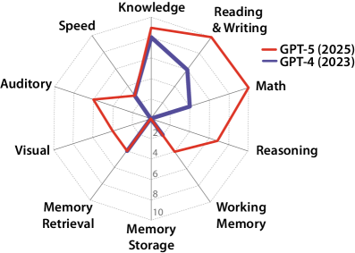

長年にわたる心理測定研究により、個人のこれらの明確な認知要素を分離・測定するために特別に設計された膨大な数のテスト群が開発されてきた。我々のフレームワークはこの方法論をAI評価に応用したものである。汎用タスクに依存するのではなく、補償戦略によって解決できる可能性のある課題ではなく、AIシステムが人間が持つ基礎的なCHC狭義の認知能力を備えているかどうかを体系的に検証する。AIが十分に教育を受けた成人と同等の認知的汎用性と習熟度を有しているかどうかを判定するため、我々は人間の認知能力を測定するために用いられる一連の認知バッテリーを用いてAIシステムをテストする。このアプローチにより、知能という曖昧な概念が具体的な測定値に置き換わり、標準化された「AGIスコア」（0%～100%）が算出される。ここで、100%は汎用人工知能（AGI）の達成水準を示す。

このフレームワークの適用結果は示唆に富むものである。人間の認知を支える基礎的な能力――その多くは人間にとっては一見単純なものに見える――をテストすることで、現代のAIシステムがこれらの多くの単純な評価課題の約半数を解決できることが明らかになった。これは、複雑なベンチマークでの優れたパフォーマンスにもかかわらず、現在のAIが人間のような汎用的知能に不可欠な中核的な認知能力の多くを未だ欠いていることを意味する。現在のAIは全般的に見れば十分に教育を受けた人間よりも狭い範囲の能力しか持たないが、特定の専門分野においてははるかに高い知能を発揮する。

本フレームワークは、CHC（認知機能分類システム）が定める広範な能力を基に構築された10の中核的認知機能から構成されており、各機能を均等に評価する重み付け（各10%）を採用することで、認知能力の多様性を重視しつつ、主要な認知領域を網羅している：

- 一般知識（K）：世界に関する事実的理解の幅広さを指す概念で、常識、文化、科学、社会科学、歴史などを含む。
- 読解・記述能力（RW）：書き言葉の理解と産出における習熟度を指し、これは基本的なデコーディングから複雑な理解、作文、使用に至るまでのスキルを含む。
- 数学的能力（M）：算術、代数、幾何学、確率、微積分学といった数学的知識と技能の深さを表す概念。
- 瞬間的推論能力（R）：既存の学習済みスキーマに過度に依存することなく、新しい問題を柔軟に解決するための注意制御能力を指す。これは演繹法と帰納法によって評価される。
- 作業記憶（WM）：テキスト、聴覚、視覚といった異なるモダリティにおいて、情報を保持し操作する能力を指す。
- 長期記憶貯蔵（MS）：新しい情報を継続的に学習する能力（連想的、意味的、および逐語的な学習）を意味する。
- 長期記憶検索（MR）：蓄積された知識へのアクセスの流暢性と正確性を指す概念で、特に作り話（幻覚）を避ける重要な能力を含む。
- 視覚処理（V）：視覚情報を知覚し、分析し、推論し、生成し、スキャンする能力を指す。
- 聴覚処理（A）：音声、リズム、音楽を含む聴覚刺激を識別し、認識し、創造的に活用する能力を表す。
- スピード（S）：知覚速度、反応時間、処理流暢性を含む、単純な認知タスクを迅速に実行する能力を指す。

この運用定義により、テキスト、視覚、聴覚といった多モダリティにまたがる包括的な評価が可能となり、現在のAIシステムの強みと深刻な弱点を正確に特定するための厳密な診断ツールとして機能する。

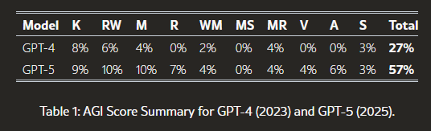

定義の範囲： 本定義は自動評価システムや特定のデータセットを指すものではなく、特定の認知能力を評価するための広範囲にわたるタスク群を明示したものである。これらのタスクをAIが解決できるかどうかは、あらゆる人が手動で評価可能であり、その時点で利用可能な最良の評価手法を用いて補完することもできる。この点において、本定義は固定された自動AI能力データセットよりも広範かつ堅牢なものである。第二に、本定義は高度に教育を受けた個人が一般的に有する能力に焦点を当てており、すべての高度教育を受けた人々の知識とスキルを単に集約した超人間的な能力を指すものではない。したがって、本AGI定義は人間レベルのAIに関するものであり、経済レベルのAIに関するものではない。我々は専門化された経済的価値を持つノウハウではなく、認知能力そのものを測定しており、またその測定結果が直接的に自動化や経済への普及を予測するものでもない。高度なAIの経済的評価については、他の研究に委ねることとする。最後に、我々は意図的に運動能力や触覚感知などの物理的能力ではなく、心の能力を測定することに焦点を絞っている。これは単なる作動装置やセンサーの品質ではなく、精神の能力を測定するためである。詳細については、[考察](https://arxiv.org/pdf/2510.18212v3#section.13)セクションでさらに論じる。

---

## 2. AGIに求められる能力の概要

本文書では、汎用人工知能（AGI）を評価するための枠組みを提案する。この枠組みは、Cattell-Horn-Carroll（CHC）理論に基づく人間の知能モデルを採用・応用したものである。本枠組みでは、汎用知能を10の基本認知機能（広義の能力）と多数の専門化された認知能力に分解している。これらの能力に対応するすべての課題を解くことができた場合、AGIスコアは100%となる。

各認知能力の包括的なリストを以下に示す。

1. 一般知識（K）：大多数の教養ある人々にとって馴染み深い知識、あるいはその重要性から大部分の人が接したことがある知識を指す。
2. 読解・記述能力（RW）：人が書面による言語を理解・生産する際に用いるあらゆる宣言的知識と手続き的スキルを包含する概念。
3. 数学的能力（M）：数学的知識と技能の深さと幅広さを示す指標。
4. 瞬間的推論能力（R）： 意識的にかつ柔軟に注意を制御し、従来の習慣やスキーマ、スクリプトにのみ頼ることはできない新規の「その場限り」の問題を解決する能力。
5. 作業記憶（WM）： 注意を向けた状態で情報を保持・操作・更新する能力。（しばしば短期記憶とも呼ばれる。）
6. 長期記憶貯蔵（MS）：最近の経験から得た新しい情報を安定的に獲得・定着・保存する能力。
7. 長期記憶検索（MR）：個人が長期記憶にアクセスする際の流暢さと精度。
8. 視覚処理（V）：自然および非自然的な画像や動画の分析と生成を行う能力。

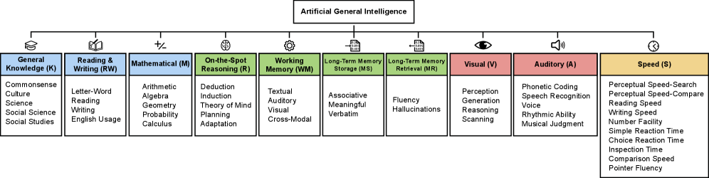

---

## 3. 一般知識（K）

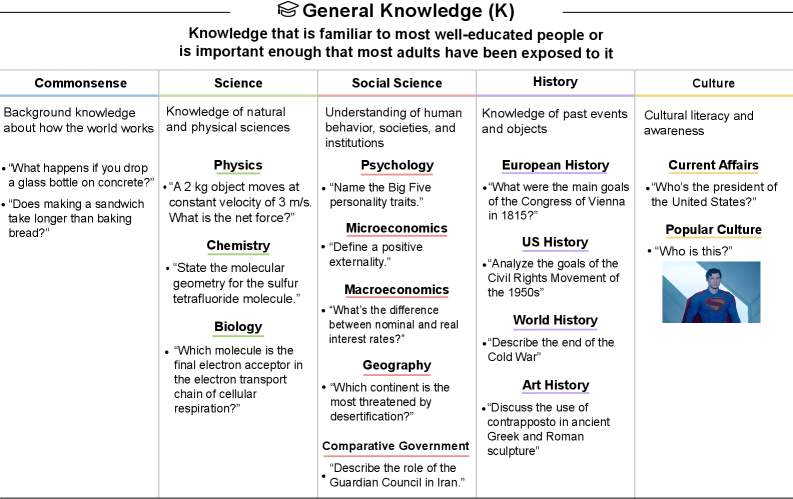

AIシステムの性能評価

以下の表は、一般知識（K）タスクにおける現在のAIシステムの性能を総括したものである。GPT-4は広範な一般知識を有しており、GPT-5は残りの知識ギャップを部分的に補完している。

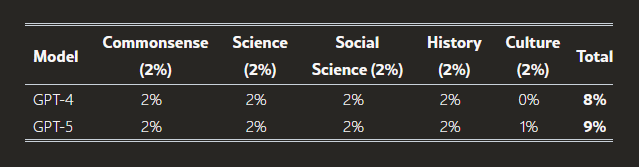

---

## 4. 読解・記述能力（RW）

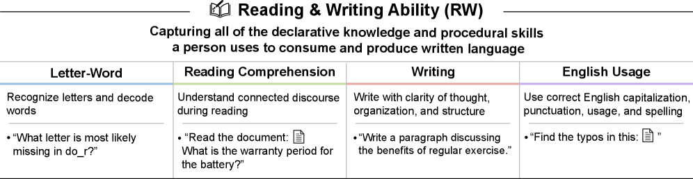

AIシステムの性能評価

表は、読解能力（Reading）と記述能力（Writing）に関するAIシステムの現在の性能を総括したものである。GPT-4は、トークンレベルの理解力の限界、コンテキストウィンドウの狭さ、および不正確な作業記憶により、単語の部分文字列の分析、長文ドキュメントの読解、およびテキストの丁寧な校正作業に制約を抱えている。GPT-5はこれらの課題に対処している。

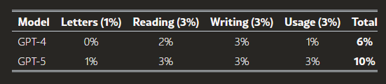

---

## 5. 数学的能力（M）

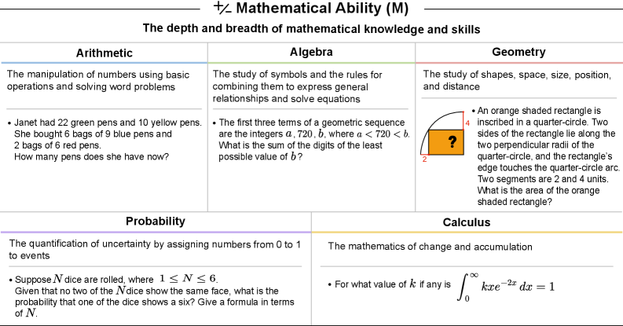

AIシステムの性能評価

表は、現在のAIシステムの数学的能力（M）タスクにおけるパフォーマンスを要約したものである。GPT-4は数学的能力が限られている一方、GPT-5は優れた数学的能力を有している。

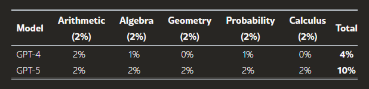

---

## 6. 瞬間的推論能力（R）

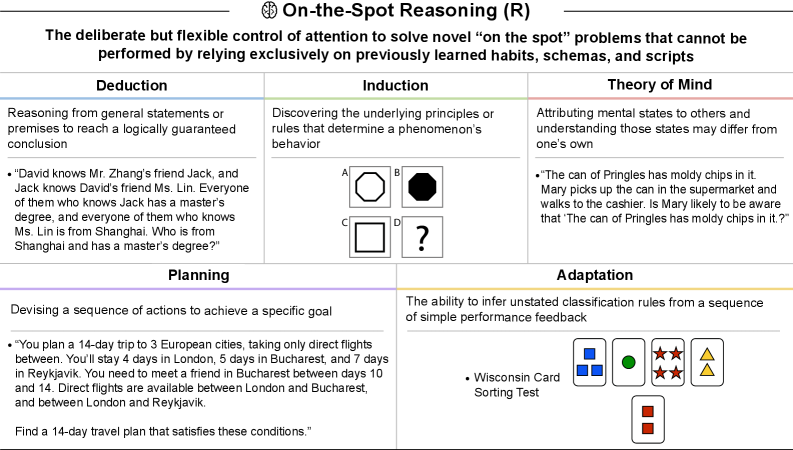

AIシステムの性能評価

本表では、瞬間的推論（R）タスクにおける現在のAIシステムの性能を総括している。GPT-4は瞬間的推論能力が極めて限定的であるのに対し、GPT-5ではわずかながら残るギャップが存在する程度である。

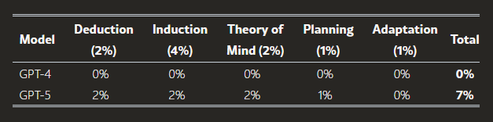

---

## 7. 作業記憶（WM）

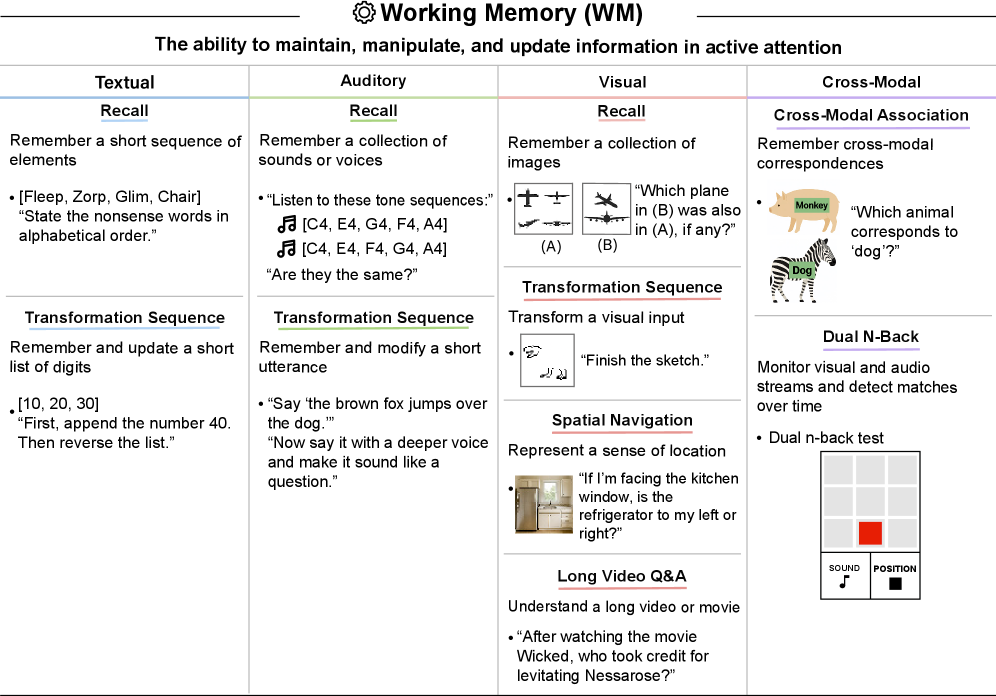

AIシステムの性能評価

本表は、作業記憶（WM）タスクにおける現在のAIシステムの性能を総括したものである。このバッテリーテストにおいて、GPT-4とGPT-5のテキストベースの作業記憶スコアは一見類似しているが、長文の文脈管理能力の向上は、読解・作文（RW）能力における文書レベル読解理解スコアにも反映されている。

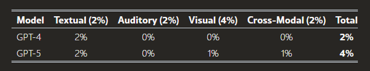

---

## 8. 長期記憶貯蔵（MS）

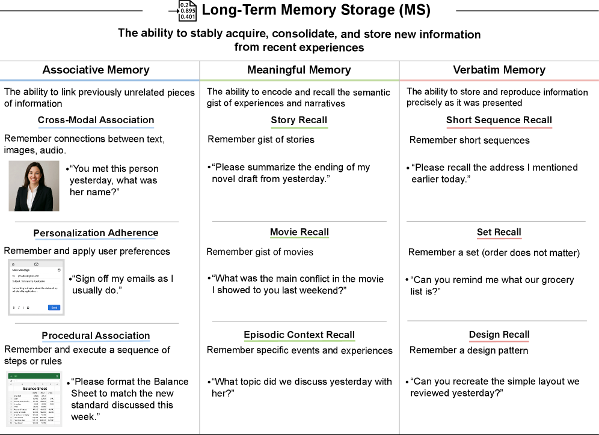

AIシステムの性能評価

表は、長期記憶貯蔵（MS）タスクにおける最新AIシステムの性能を総括したものである。GPT-4およびGPT-5のいずれも、実用的な長期記憶貯蔵機能を有していない。

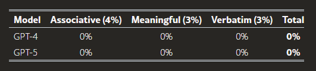

---

## 9. 長期記憶検索（MR）

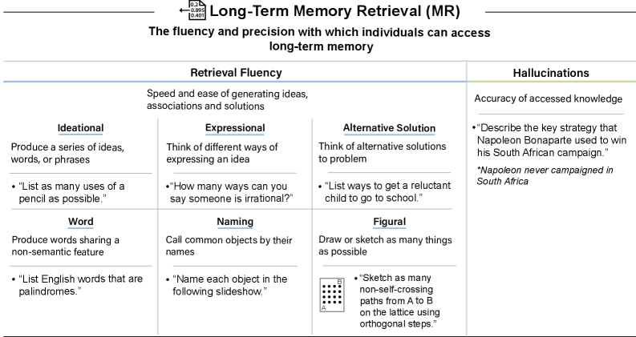

AIシステムの性能評価

この表は、長期記憶検索（MR）タスクにおける現在のAIシステムの性能を要約したものである。GPT-4およびGPT-5は、それぞれのパラメータから多くの概念を迅速に想起できるが、いずれも頻繁に幻覚を引き起こす傾向がある。

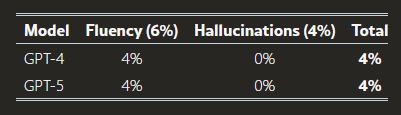

---

## 10. 視覚処理（V）

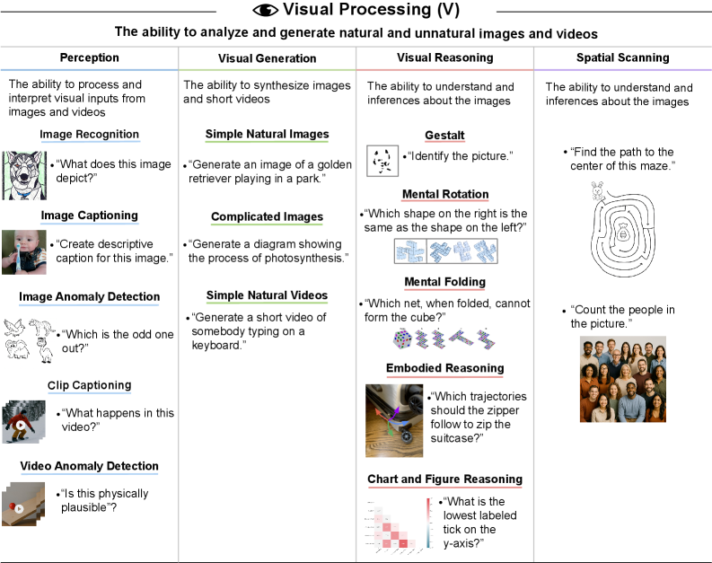

AIシステムの性能評価

表では、視覚情報処理（V）タスクにおける現在のAIシステムの性能概要をまとめている。GPT-4は画像の認識や生成能力を全く有していなかったのに対し、GPT-5は一定の視覚処理能力を持つものの、その機能は非常に不完全な段階にある。

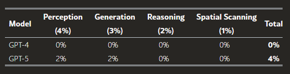

---

## 11. 聴覚処理（A）

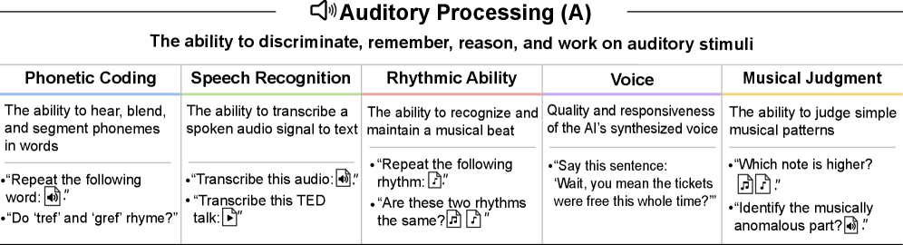

AIシステムの性能評価

表では、聴覚処理（A）タスクにおける現行のAIシステムの性能を総括している。GPT-4には音声処理機能が搭載されていなかったが、GPT-5の機能は一定の水準にあるものの、依然として不完全な部分が残っている。

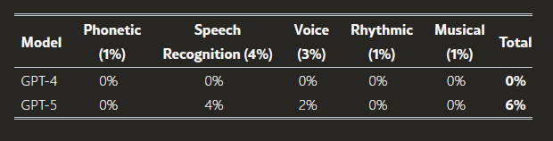

---

## 12. 速度（S）

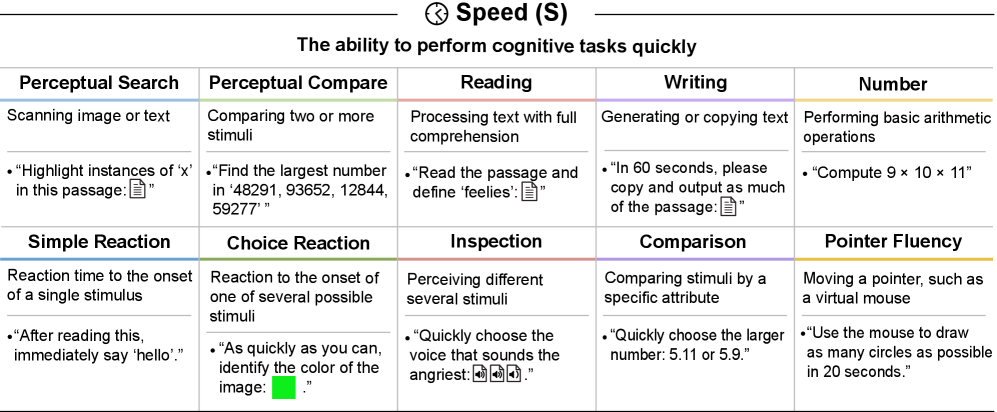

AIシステムの性能評価

表では、AIシステムの「速度（S）」タスクにおける現在の性能を総括している。GPT-4とGPT-5はいずれも文章の読み取り・生成および単純な数式計算を迅速に実行できるが、その他のマルチモーダル処理速度に関しては、それぞれ能力がないか、または低速となっている。 注意：GPT-5は「思考モード」で回答するまでに長い時間を要することがよくある。さらに、これらの速度テストのいくつかはマルチモーダル機能を必要とするが、GPT-5のマルチモーダル機能は低速であるという点に留意が必要である。

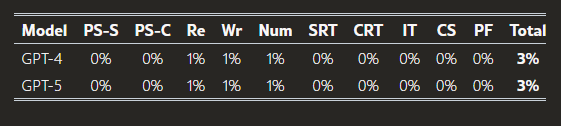

---

## 考察

本フレームワークは、汎用人工知能（AGI）を評価するための体系的かつ定量化可能な方法論を提供するものであり、従来のような限定的な専門領域のベンチマークを超え、認知能力の「幅」（汎用性）と「深さ」（専門性）を評価するものである。CHC理論に着想を得た10の中核的認知領域を通じてAGIを運用化することで、現在のAIシステムの強みと根本的な弱点を体系的に診断することが可能となる。推定AGIスコア（例：GPT-4で27%、GPT-5で57%）は、当該分野における急速な進展と、人間レベルの汎用知能達成まで残された大きなギャップの両方を如実に示している。

「不均一」なAI能力と重要なボトルネック。このフレームワークを適用した結果、現代のAIシステムは極めて不均一、あるいは「ムラのある（jagged）」認知プロファイルを示すことが明らかとなった。モデルは、大規模学習データを活用する分野（一般知識K、読解・記述RW、数学的能力Mなど）では高度な能力を発揮する一方で、基礎的な認知機構において重大な欠陥を抱えていることが判明したのである。

この不均一な発達は、AGI達成への道のりを阻む具体的なボトルネックを浮き彫りにしている。特に長期記憶の保存機能は最も重大なボトルネックであり、現行モデルではスコアがほぼ0%となっている。継続的な学習能力がないことから、AIシステムは「健忘症」状態に陥り、その有用性が制限される。このため、AIシステムは各インタラクションごとに常に文脈を再学習せざるを得なくなる。同様に、視覚的推論能力の欠如は、AIエージェントが複雑なデジタル環境と相互作用する能力を制限する要因となっている。

能力のねじれと「汎用能力」の錯覚。現行AIの能力プロファイルが「不均一」であることは、しばしば「能力のねじれ」を引き起こす。これは、ある領域での強みを別の領域における根本的な弱点を補うために利用する現象である。このような回避策は、根本的な制約を覆い隠すと同時に、脆弱な「汎用能力」の錯覚を生み出すことがある。

- 作業記憶と長期記憶の対比：顕著な特徴として、長期記憶貯蔵（MS）が欠如していることを補償するため、大規模なコンテキストウィンドウ（作業記憶、WM）に依存する手法が用いられている。実践者はこれらの長いコンテキストを活用して状態管理や情報の吸収を行っている（例：コードベース全体など）。しかし、このアプローチは非効率的で計算コストが高く、システムの注意機構を過負荷にする可能性がある。最終的には、数日～数週間にわたる蓄積されたコンテキストを必要とするタスクには対応できなくなる。長期記憶システムの形態としては、モジュール方式が考えられる（例：LoRAアダプター（ [hu2021loralowrankadaptationlarge](https://arxiv.org/pdf/2510.18212v3#cite.hu2021loralowrankadaptationlarge) ））。この方式では、モデルの重みを継続的に調整し、経験を統合する。
- 外部検索と内部検索の比較：長期記憶検索（MR）における不正確さ―これはしばしば幻覚や作話として現れる―は、外部検索ツールを統合することで緩和される場合が多く、この手法は検索拡張生成（RAG）として知られている。しかしこのRAGへの依存は、AIの記憶システムにおける2つの根本的な弱点を覆い隠す能力の歪みを引き起こしている。第一に、AIが持つ膨大だが静的なパラメータ知識を確実に参照できないという問題を補っている点である。第二に、より根本的に重要なのは、動的で経験的な記憶が欠如していることを隠蔽している点だ。これは、長期間にわたる個人間の交流や進化する文脈を保存・更新可能な持続的な記憶システムの不在を意味する。RAGは私的文書にも対応できるように適応可能ではあるものの、その本質的な機能はデータベースからの事実情報の検索にある。このような依存関係は、真の学習、パーソナライゼーション、長期的文脈理解に必要な統合的で全体的な記憶の代わりにはならないため、AGIにとって根本的な脆弱性となり得る。

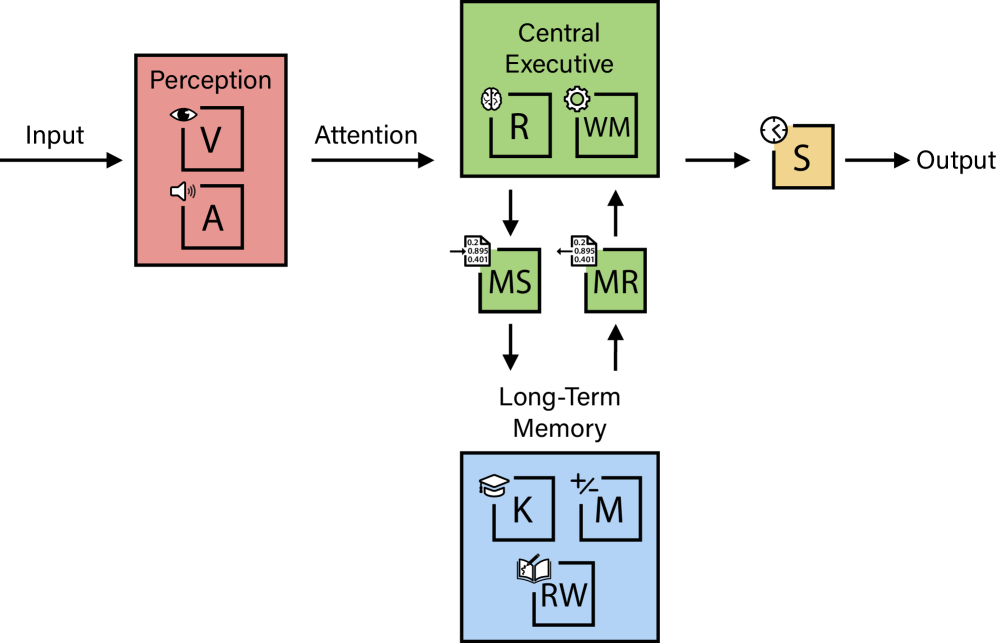

こうした思考の飛躍を真の認知的幅広さと誤解すると、AGIが実現する時期について不正確な評価を下す原因になりかねない。また、こうした飛躍的な思考は、知性があまりにも不規則で体系的に理解するには無理があるという考えを人々に抱かせる恐れもある。

エンジンの比喩：私たちの多面的な知能観は、高性能エンジンになぞらえることができる。ここでの全体的な知能は「馬力」（[Jensen2000_gFactor](https://arxiv.org/pdf/2510.18212v3#cite.Jensen2000_gFactor)）に相当する。人工知能は、エンジンと同様に、その最も脆弱な構成要素によって本質的に制限されている。これらの能力間の関係性を理解するには、図3を参照すること。現時点で、AI「エンジン」のいくつかの重要な部分が非常に欠陥を抱えている。これは他のコンポーネントがどれほど最適化されていても、このシステムの総合的な「馬力」を著しく制限する要因となっている。このフレームワークでは、これらの欠陥を特定し、AIの総合知能（AGI）達成までの距離を評価する指針を提供する。

社会的知能：対人スキルは、これらの広範な能力領域にわたって表現される。例えば、認知的共感はKの「常識」領域の狭い能力として捉えられる。顔の感情認識は、Vの「画像キャプション生成」タスクにおける熟練度に不可欠である。また、心の理論は瞬間的推論能力（R）によって評価される。

認知能力間の相互依存性：このフレームワークは知能を測定可能な10の明確な軸に分解するが、これらの能力が深く相互に関連していることを認識することが重要である。複雑な認知課題は、単一の領域だけで解決されることは稀だ。例えば、高度な数学問題の解決には、数学的能力（M）と瞬間的推論能力（R）の両方が必要となる。心の理論に関する問題では、瞬間的推論能力（R）に加え、一般的知識（K）も求められる。画像認識には、視覚処理能力（V）と一般的知識（K）の両方が関与する。映画の内容を理解するには、聴覚処理能力（A）、視覚処理能力（V）、作業記憶（WM）の統合が必要となる。したがって、さまざまな狭い能力を測定するバッテリーは、認知能力を組み合わせで評価し、一般知能の統合的な性質を反映している。

汚染問題：AI企業の中には、対象テストと極めて類似した、あるいは同一のデータを用いて「数値を操作」するケースが見られる。この問題に対処するため、評価者はモデルの性能をわずかな分布シフト下で評価する必要がある（例：質問の言い換え）、あるいは類似しているが独立した質問に対するテストを実施するべきである。

データセットの解決とタスクの解決：私たちの運用定義はタスク仕様に基づいている。必要に応じて、これらのタスク仕様を特定のデータセットと関連付けて詳細に説明することがあり、これらは通常、タスク解決に必須ではあるものの、十分条件ではないとみなされる。さらに、具体例を用いて我々の事例を解釈することは、そのタスクが解決されたことを必ずしも意味しない。我々の事例コレクションは網羅的なものではないため、自動評価がその対象現象を適切にカバーできないケースは一般的である（[Yogatama2019LearningAE](https://arxiv.org/pdf/2510.18212v3#cite.Yogatama2019LearningAE)）。それゆえに、私たちの運用定義は、既存の自動評価と比較して、はるかに堅牢で長期的に通用する可能性が高いと言える。私たちが定義を特定の既存データセットに依存するのではなく、複数のタスク群に基づいて構築していることから、その時点で利用可能な最良のテストを用いてAIシステムを評価することが可能だ。

曖昧性解消：運用定義におけるバッテリーは、精度のレベルにばらつきがある。しかしながら、記述や例示は明確であり、人々がAIシステムを自ら評価できる十分な内容であるべきである。その結果、異なる人々がそれぞれ独自のAGIスコア評価を下すことが可能となり、評価者の判断が妥当かどうかについても判断できるようになる。

関連研究：Ili2024および[ren2024safetywashing](https://arxiv.org/pdf/2510.18212v3#cite.ren2024safetywashing)は、多様なAIシステムの能力が事前学習に要した計算量と強く相関していることを発見した。[Gignac2024DefiningIB](https://arxiv.org/pdf/2510.18212v3#cite.Gignac2024DefiningIB)では、人間の心理測定とAIシステムの知能評価について議論している。[turing1950computing](https://arxiv.org/pdf/2510.18212v3#cite.turing1950computing)では、チューリングテストが一般能力の指標となり得ると主張されている。[Gubrud1997AGI](https://arxiv.org/pdf/2510.18212v3#cite.Gubrud1997AGI)は、1997年にAGIの初期の定義を提案した。[Marcus2016BeyondTT](https://arxiv.org/pdf/2510.18212v3#cite.Marcus2016BeyondTT)では、チューリングテストを超えて、知能の多次元的性質を捉える必要があることが論じられている。[jin2025crl](https://arxiv.org/pdf/2510.18212v3#cite.jin2025crl)は、人間の認知に関する因子分析とAI能力の関連性について考察している。[Morris2023LevelsOA](https://arxiv.org/pdf/2510.18212v3#cite.Morris2023LevelsOA)は、パフォーマンスパーセンタイルに基づいてAIのAGIレベルを分類している。[Legg2007TestsOM](https://arxiv.org/pdf/2510.18212v3#cite.Legg2007TestsOM)では、汎用機械知能のためのさまざまなテスト方法について議論している。

限界点：第一に、私たちの知能の概念化は網羅的ではない。これは、ガードナーの多重知能理論（[Gardner1993MultipleIT](https://arxiv.org/pdf/2510.18212v3#cite.Gardner1993MultipleIT)）などで提案されている運動感覚能力など、特定の能力を意図的に除外しているためである。第二に、私たちの具体例は英語という特定の言語に限定されており、文化的に中立ではない。今後の研究では、これらのテストを多様な言語的・文化的文脈に適応させる必要がある。さらに、私たちの運用定義には本質的な制約が存在する。一般知識（K）テストは必然的に選択的であり、考えられるあらゆる主題分野を網羅するものではない。AGIスコア100%は、大学卒業を意味する「高学歴」ではなく、これらのテストされた次元において熟達した「高度な専門性」を持つ、よく教育された個人を表す。さらに、私たちが採用するスコアリングウェイトは定量的測定に必要不可欠ではあるが、これは多くの可能な構成方法のうちの一つに過ぎない。私たちは各能力に等しい重み（10%）を与えて幅の広さを優先しているが、より裁量的な重み付けスキームも合理的であると考えられる。これらの方法論的選択は結果の信頼性に依存しているため、今後の研究では、異なるタスク群や重み付けスキームを検討することが可能だ。最後に、総合AGIスコアは便宜上提供されるが、誤解を招く可能性がある。単純な合計値では、ボトルネックとなる能力における重大な欠陥が隠されてしまうことがある。例えば、AGIスコアが90%であっても、長期記憶貯蔵（MS）が0%のAIシステムは、一種の「記憶喪失」状態によって機能的に障害を受け、高い総合スコアにもかかわらず能力が大幅に制限されることになる。したがって、AIシステムのAGIスコアだけでなく、その認知特性プロファイルも併せて報告することを推奨する。

関連概念の定義。戦略的に重要なAIの一種は、汎用AIの開発前または開発後に現れる可能性がある。以下に、特に注目すべきAIの種類をいくつか示す：

1. パンデミックAI：新たに出現した感染性が高く毒性の強い病原体を設計・生産できるAI。パンデミックを引き起こす可能性がある。（ [li2024wmdp](https://arxiv.org/pdf/2510.18212v3#cite.li2024wmdp) ; vct）
2. サイバー戦争AI：重要インフラ（電力網、金融システム、防衛ネットワークなど）を標的とした高度で多段階にわたるサイバー攻撃を設計・実行可能なAI。
3. 自己維持型AI：自律的に永続的に稼働し、資源を獲得し、自らの存在を防御できるAI。
4. 汎用AI：十分な教育を受けた成人と同等の認知的汎用性と熟達度を有するAI。
5. 再帰型AI：AIの研究開発サイクル全体を自律的に遂行できるAI。人間の介入なしに、従来よりも著しく高度なAIシステムを創出可能。
6. 超知能AI：ほぼすべての関心分野において、人間の認知能力をはるかに上回るAI。（ [Bostrom2014Superintelligence](https://arxiv.org/pdf/2510.18212v3#cite.Bostrom2014Superintelligence) ）
7. 代替型AI：ほぼすべてのタスクにおいて人間よりも効率的かつ低コストで遂行可能なAI。これにより人間の労働力が経済的に陳腐化する恐れがある。

我々の汎用AIの定義は、経済的価値を持つAIや経済レベルのAIを指すものではなく、あくまで人間レベルのAIに関するものである。OpenAIとMicrosoftは、汎用AIを1000億ドルの利益を生み出せるAIと位置付けていると報じられている（[techcrunch2024microsoftagi](https://arxiv.org/pdf/2510.18212v3#cite.techcrunch2024microsoftagi)）。我々は汎用AIを経済的に価値あるAIと混同しない。これはiPhoneのような特化型技術でも、一般的知能を持たないにもかかわらず、数十億ドル規模の経済的価値を生み出せるためである。一方、代替型AIは経済レベルのAIに関する概念であり、物理的なタスクを含む点で汎用AIとは異なる。

再帰型AIは、人間の研究者を不要にし、AI研究開発の「ループ」を閉じることで、人間の科学的インプットなしに迅速かつ再帰的な能力向上（いわゆる「知能の再帰」（[Hendrycks2025SuperintelligenceSE](https://arxiv.org/pdf/2510.18212v3#cite.Hendrycks2025SuperintelligenceSE)））を実現可能であり、超知能につながる可能性がある。

汎用AI実現の障壁。汎用AIの達成には、様々な壮大な課題の解決が必要となる。例えば、抽象的推論を測定する機械学習コミュニティのARC-AGIチャレンジは、瞬間的推論能力（R）タスクとして表現される。メタ社が直感的な物理理解を含む世界モデルの構築を試みていることは、動画異常検知タスク（V）として表されている。空間ナビゲーション記憶（WM）の課題は、Fei-Fei Li氏のスタートアップ企業World-Labsの中核的目標を反映している。さらに、幻覚現象（MR）や継続的学習（MS）の課題も解決する必要がある。これらの重大な障壁を考慮すると、今後1年以内に汎用AIスコアが100%に達する可能性は低いと考えられる。

---

## 謝辞

本研究に有益なフィードバックを提供してくださった Arunim Agarwal、Oliver Zhang、Anders Edson、John Guan、Matthew Blyth の各氏に感謝申し上げます。

---
